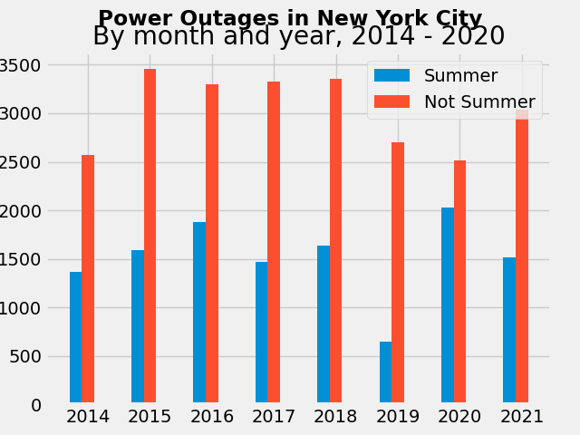
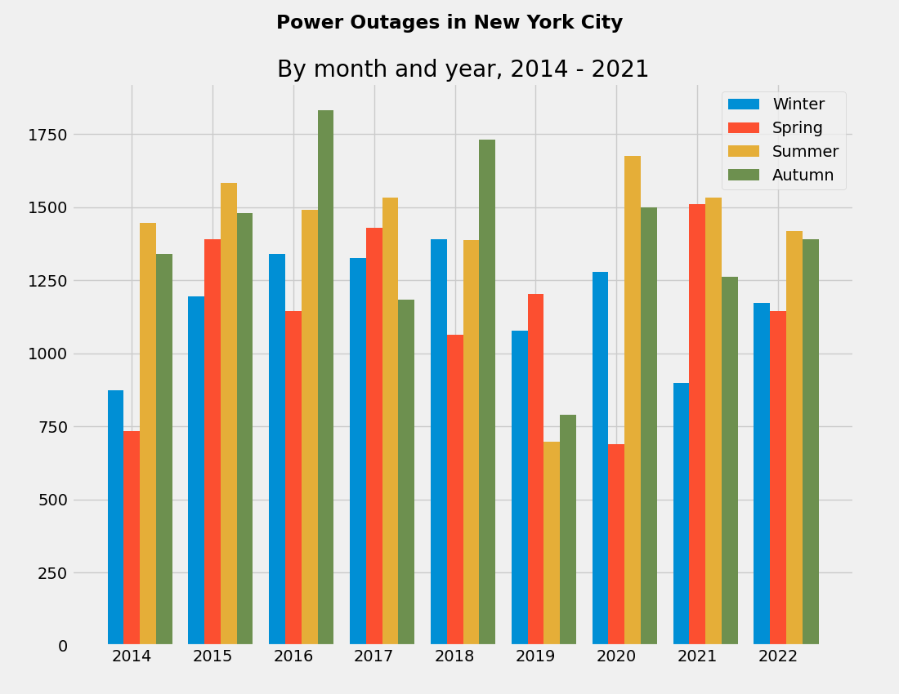
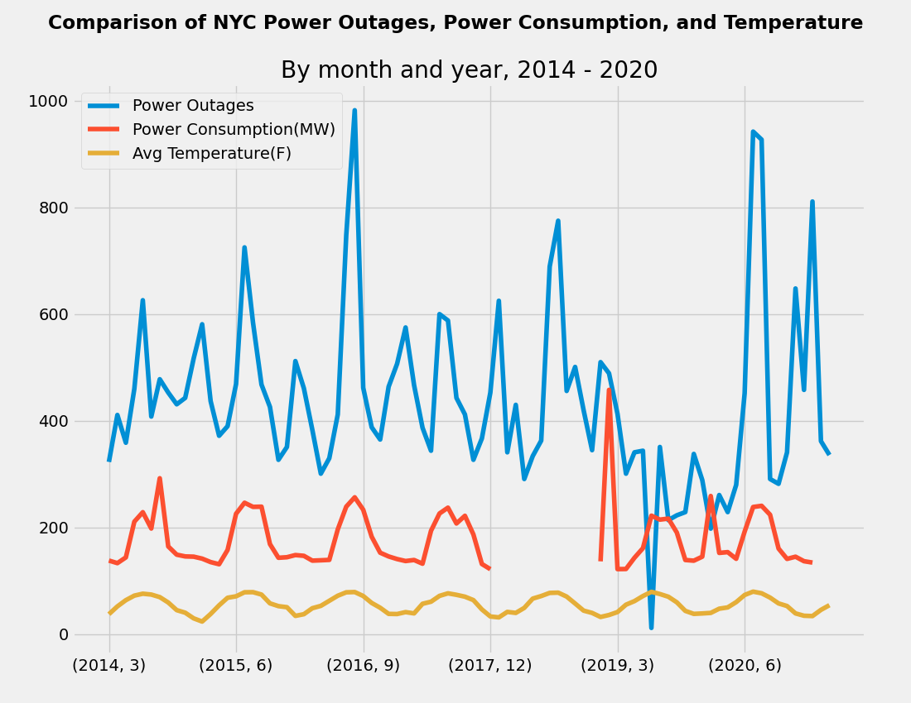

#A Deeper Look into Summer Heat and Power Outages


Overview: During the summer, black outs are a common occurence despite energy saving measures. The goal of this project is to look into public data of power outages in NYC and see if power outages really are the most common in the summer and to see if is getting better or worse.

Data: Data for powere outages and energy consumption came from NYC Open Data and data of average monthly temperatures came from weather.gov.

Methods/Tools: Pandas, Numpy, Datetime, Matplotlib. Data was organized using pandas, numpy, and datetime. Data was visualized using matplotlib. 

### Power Outages in the Summer
The graph below shows the number power outages that occured in the summer compared to those that occured in the rest of the year. The unusual dip in 2019 is due to missing data for nearly all of July 2019. It is likely there are other gaps of missing data. The "prediction" for the next year is an average of the previous years for summer and not summer. This was created 

This graph shows that summers are when a significant number of outages occur compared to the rest of the year, but it is difficult to see if there are any trends of increase/decrease in power outages due to lack of historical data prior to March 2014.



### Seasons
The graph below is also a visualization of power outages but divides the year into seaasons. This was created using a dictionary to organize months by seasons.




### Comparison
The graph below shows the average temperatures, electric comsumption, and power outages in comparison with each other. In order to visualize these three variables in a single plot, power comsumption has been converted to MW. The gap in power comsumption is due to missing data for entirety of 2018. The missing data from power outages is again shown. 

This graph show peaks and dips of these three variables generally align with each other. Most of the data appears cyclically with no strong trends. 




Techniques:

First import data using pandas
```
ec_df = pd.read_csv("Electric_Consumption_And_Cost__2010_-_April_2020.csv")
po_df = pd.read_csv("power_outage_complaints.csv")
temp_df = pd.read_csv("CentralPark_Average_Monthly_Temperatures.csv")

```
Make the data usable using datetime and dictionary
```
seasons = {1: 0, 2: 1, 3: 1, 4: 1, 5: 2, 6: 2, 7: 2, 8: 3, 9: 3, 10: 3, 11: 0, 12: 0}

po_df['Date'] = pd.to_datetime(po_df['Created Date'])
po_df['Season'] = po_df['Date'].dt.month.map(seasons)
ec_df['Date'] = pd.to_datetime(ec_df['Revenue Month'], format='%Y-%m')
temp_df['Date'] = pd.to_datetime(temp_df['Date'], format='%Y-%m')
```

To compare year by seasons
```
results = pd.DataFrame()
results['Summer'] = po_df['Season'].where(po_df['Season'] == 2).groupby([po_df['Date'].dt.year]).count()
results['Winter'] = po_df['Season'].where(po_df['Season'] == 0).groupby([po_df['Date'].dt.year]).count()
results['Spring'] = po_df['Season'].where(po_df['Season'] == 1).groupby([po_df['Date'].dt.year]).count()
results['Autumn'] = po_df['Season'].where(po_df['Season'] == 3).groupby([po_df['Date'].dt.year]).count()
```

To compare year by summer and not summer
```
results['Total'] = po_df['Season'].groupby([po_df['Date'].dt.year]).count()
results['Summer'] = po_df['Season'].where(po_df['Season'] == 2).groupby([po_df['Date'].dt.year]).count()
results['Not Summer'] = results['Total'] - results['Summer']
```

To compare power outages, power consumption, and average temperature
```
allThree = pd.DataFrame()
allThree['Temperature'] = temp_df['Avg(F)'].groupby([temp_df['Date'].dt.year, temp_df['Date'].dt.month]).mean()
allThree['Energy'] = ec_df['Consumption (KW)'].groupby([ec_df['Date'].dt.year, ec_df['Date'].dt.month]).sum() / 1000
allThree['Total'] = po_df['Season'].groupby([po_df['Date'].dt.year, po_df['Date'].dt.month]).count()
```
To get prediction for the next year
```
results = results.append(pd.DataFrame(
    [[0, results['Summer'].mean(), results['Winter'].mean(), results['Spring'].mean(),results['Autumn'].mean(), results['Not Summer'].mean()]],
    columns=['Total','Summer','Winter','Spring','Autumn','Not Summer'],
    index=[2022])
)
```

Limitations: 
What is considered a power outages are power outage complaints as actual data of power outages was not publically available. The data starts from March 2014 and has gaps of missing data which limits the ability to see trends. 

Citations:

-https://www.epa.gov/climate-indicators/climate-change-indicators-heat-waves

-https://ny.curbed.com/2019/7/15/20694840/nyc-blackout-power-outage-coned-heat-wave

-https://www.eia.gov/todayinenergy/detail.php?id=43635#tab1

-https://www.weather.gov/okx/CentralParkHistorical

-https://data.cityofnewyork.us/Social-Services/power-outage-complaints/br6j-yp22

-https://data.cityofnewyork.us/Housing-Development/Electric-Consumption-And-Cost-2010-April-2020-/jr24-e7cr
